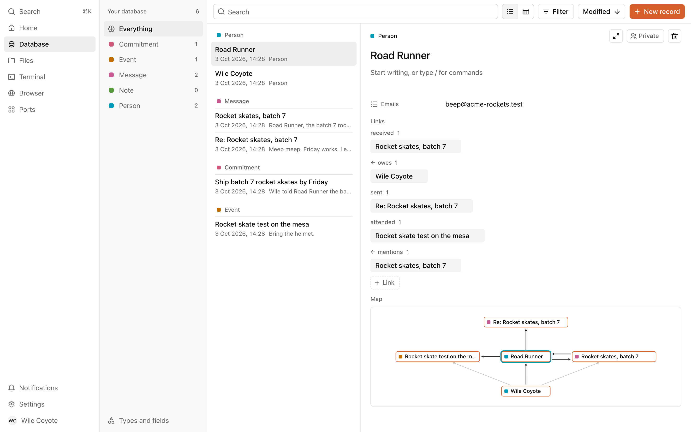
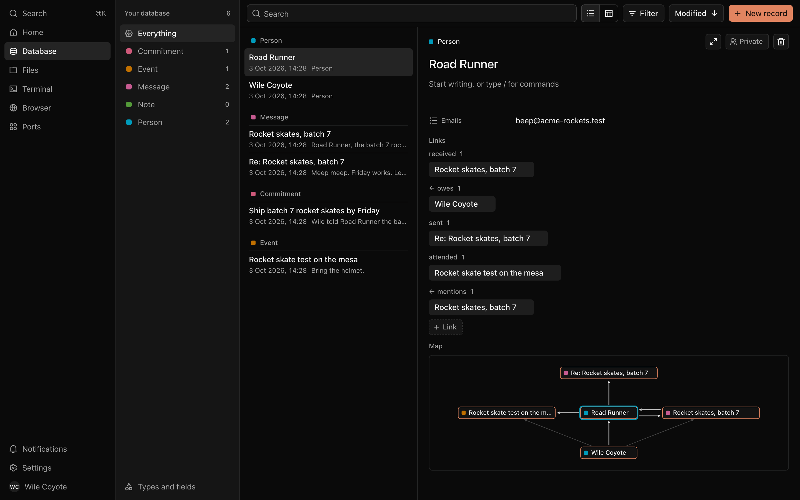
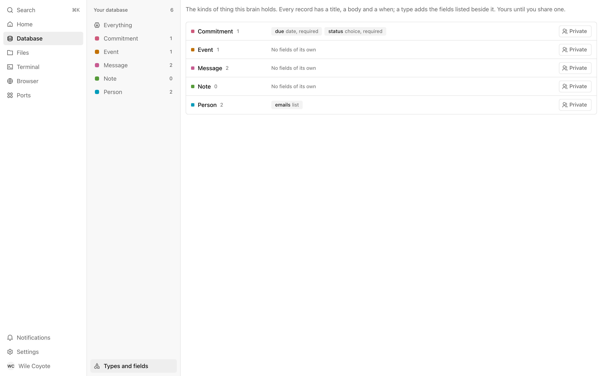
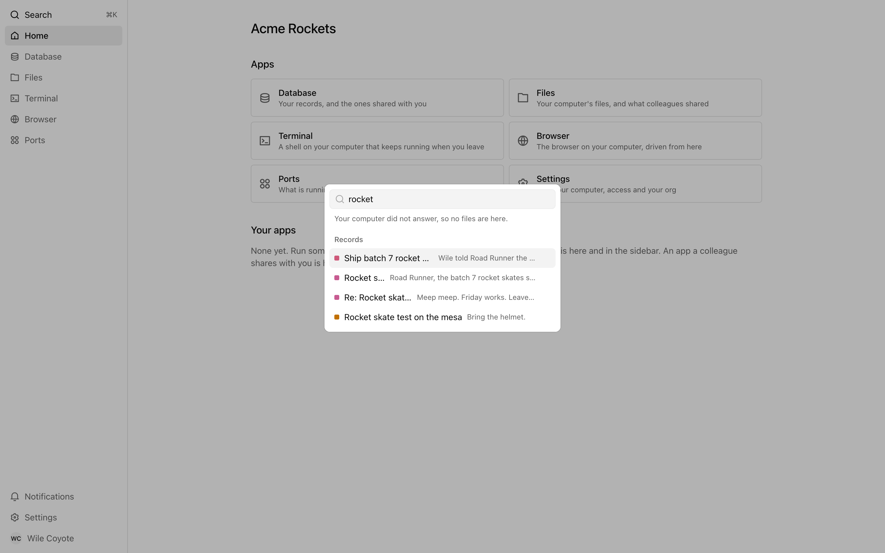
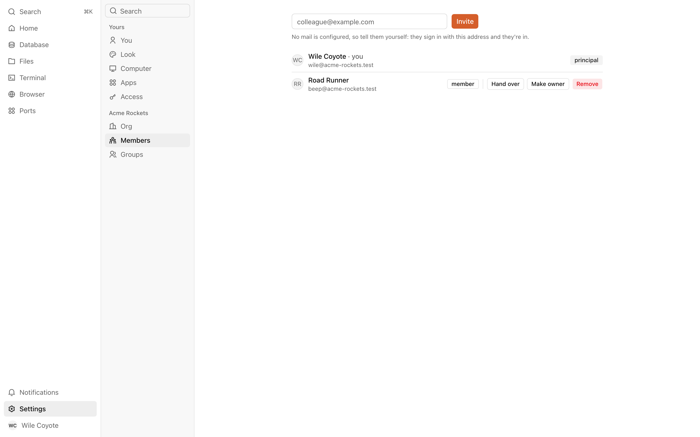
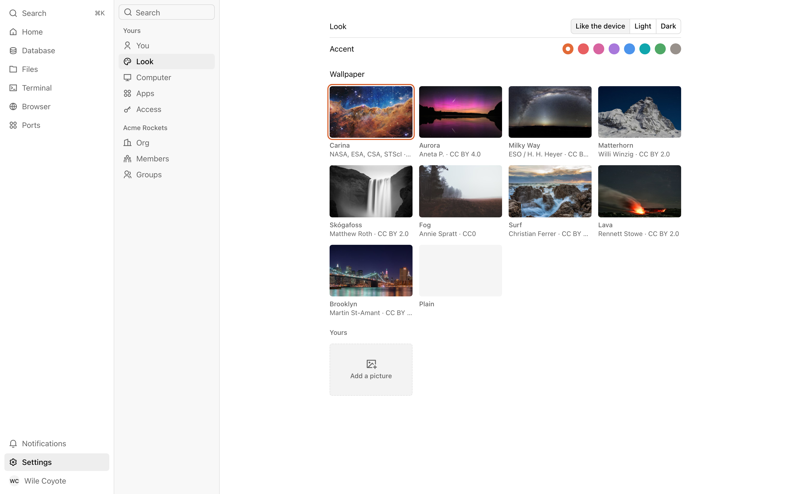
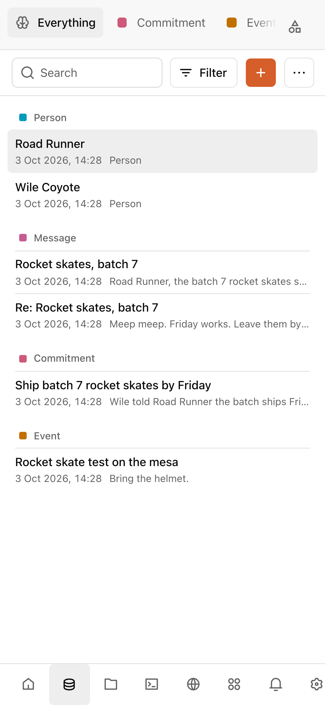
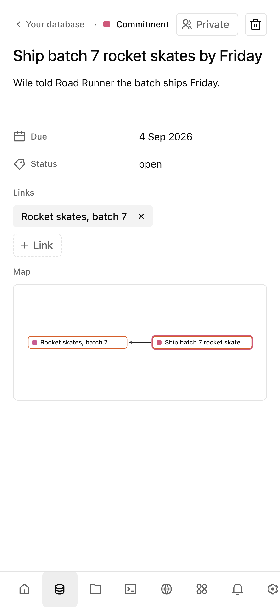
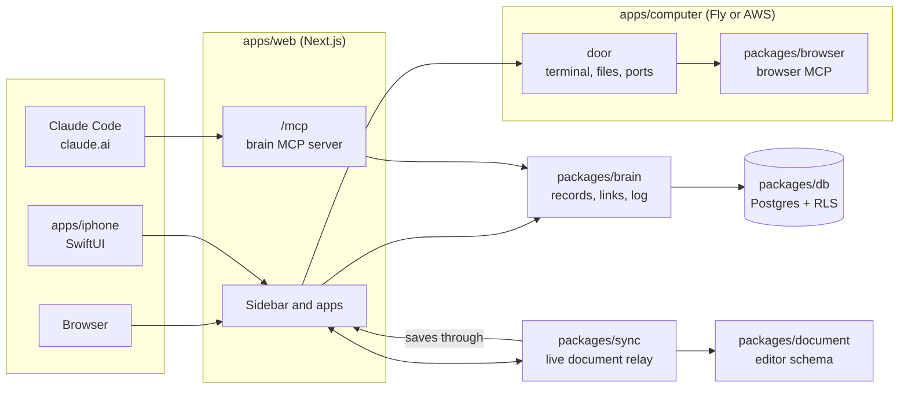

<div align="center">


# Maslow

**A shared brain and a cloud computer for every person in your org, open to Claude.**

[](LICENSE)
[](https://www.typescriptlang.org)
[](https://nextjs.org)
[](https://www.postgresql.org)
[](#claude-and-the-brain)

<br />



</div>

## What is Maslow

Maslow gives each person in an org 2 things. The first is a brain: records,
the links between them, and a log of every change, in the person's own types.
The second is a Linux computer in the cloud that keeps running when they
leave, with a terminal, files, a browser and the ports they open.

The brain is an MCP server. Connect Claude Code or claude.ai to it, and
Claude reads and writes the brain as you, under your sign-in, with every
write logged as the model's. On the computer, your own Claude Code is the
word `claude` away in the terminal, already connected to your brain and to
the computer's browser.

The interface is a sidebar and the app you picked, filling the rest of the
screen: Home, Database, Files, Terminal, Browser, Ports, your own apps, and
Settings. On a phone the same places are tabs along the bottom.

## Features

<table>
<tr>
<td width="50%" valign="top">

### A brain of records and links

Each record has a type, a title, a body in markdown and the fields its type
declares. Links carry any verb you like (`owes`, `sent`, `attended`), and a
map shows what a record touches. Every change is in a numbered log and can be
walked back.

</td>
<td width="50%" valign="top">



</td>
</tr>
<tr>
<td width="50%" valign="top">



</td>
<td width="50%" valign="top">

### Your vocabulary, not ours

Types are the person's own. A type can declare fields (a date, a choice, a
list) and values must fit. Each type is private until you share it with a
colleague or a group.

</td>
</tr>
<tr>
<td width="50%" valign="top">

### Command-K finds anything

One field over the screen finds an app, a pane of Settings, a record or a
file in your home by its words. An agent's `search` looks by words first,
then by meaning through embeddings.

</td>
<td width="50%" valign="top">



</td>
</tr>
<tr>
<td width="50%" valign="top">



</td>
<td width="50%" valign="top">

### Orgs, members and groups

Everyone is in an org; a person alone is an org of 1. Every row belongs to an
org, and Postgres row-level security enforces it. Each org has a principal
who can hand it over or delete it. A member who leaves is kept, unseen, until
an owner brings them back or purges them.

</td>
</tr>
<tr>
<td width="50%" valign="top">

### A computer per person

Each member gets a Linux machine with at least 4 CPUs, 8 GB of memory and a
disk that grows. The terminal survives a restart. Ports can be opened, shared
with a colleague, or named and shown in the sidebar as an app. Machines run on
Fly, or on EC2 in your own AWS account.

</td>
<td width="50%" valign="top">



</td>
</tr>
</table>

### On a phone

<p align="center">

&nbsp;&nbsp;&nbsp;

</p>

The web app fits a phone, with the places as tabs a thumb can hit. A native
iPhone app in `apps/iphone` (SwiftUI, iOS 26) reads the same brain and shows
what waits on you.

### Also in the box

- **Live editing.** While people are in a record, its body is 1 live document
  in a relay of ours. Each caret carries its owner's name, and each save is 1
  person's.
- **Connections.** A person connects their outside accounts once. An agent
  reaches every connected app through 3 MCP tools: `apps`, `find` and `run`.
- **Notifications and asks.** An agent can `notify` you or `ask` you a
  question; you answer it where it stands.
- **Your data leaves with you.** `packages/brain` exports a person's brain to a
  file that imports into any brain. It has no page yet.

## Architecture



| Path                | What it is                                                                                       |
| ------------------- | ------------------------------------------------------------------------------------------------ |
| `apps/web`          | The Next.js app: sign-in, the shell, every page, the brain's MCP server at `/mcp`, and the sweep |
| `apps/computer`     | The image each person's computer runs, and its door: the terminal, files, ports and backups      |
| `apps/iphone`       | The native iPhone app                                                                            |
| `packages/brain`    | Records, links, types, search, sharing, history and revert                                       |
| `packages/db`       | Migrations, the seed, and connections as a restricted role under row-level security              |
| `packages/sync`     | The relay that holds a record's live document and saves through the app                          |
| `packages/document` | The editor's schema, shared by the page and the relay                                            |
| `packages/browser`  | An MCP server that drives Chromium with Playwright                                               |
| `infra/aws`         | A Terraform template to run Maslow in your own AWS account                                       |

## Quick start

```
pnpm install && pnpm dev
```

That fetches a real Postgres binary from npm, migrates it, seeds 3 fictional
orgs (Acme Rockets, Blue Whale Bakery and Chartreuse Observatory) and prints
the URL. No Docker and no credentials are needed. Sign in by picking a seeded
person, such as Wile Coyote, on the sign-in screen. Vendors without keys are
faked, and the app says which.

Node 24 to develop on, 22.18 at the least, and pnpm.

`pnpm check` is the merge gate. Read [CLAUDE.md](CLAUDE.md) before changing
anything, and [REVIEW.md](REVIEW.md) before merging. Sign-in with email
codes, dev secrets, vendors, previews and what production requires are in
[docs/DEVELOPING.md](docs/DEVELOPING.md).

## Claude and the brain

The brain is an MCP server at `/mcp`, behind the same sign-in as the site.
Give Claude Code the URL and it does the rest:

```
claude mcp add --transport http brain https://<host>/mcp
```

On claude.ai, add the same URL as a custom connector. Either way a browser
opens, you sign in and allow it, and Claude reads and writes your brain as
you, in the org you were signed in to. Every write it makes is logged as
the model's. Disconnect it under Access in Settings. Locally the host is the
one `pnpm dev` prints; claude.ai cannot reach a laptop.

The server offers tools to read (`catalog`, `list`, `get`, `graph`,
`search`, `history`), to write (`write`, `edit`, `remove`, `restore`,
`unlink`, `merge`, `unmerge`, `revert`, `redefine`, `undefine`), to share
(`share`), to reach the person (`notify`, `ask`, `notifications`, `open`),
to arrange Home (`desktop`, `place`, `unplace`), and to act in connected
apps (`apps`, `find`, `run`).

## License

Maslow is licensed under the GNU Affero General Public License, version 3.
See [LICENSE](LICENSE), and [NOTICE](NOTICE) for the third-party code and
assets it carries.
